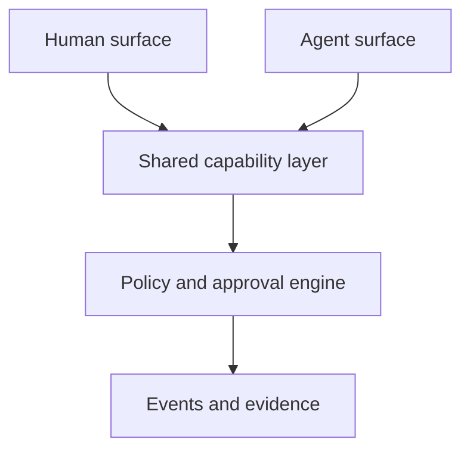

In an agent first SaaS, the GUI does not disappear. Its role changes.

A traditional GUI helps a person discover available actions, provide input, understand system state, move between objects, and confirm results. An agent needs the same support, but it consumes structured data, schemas, permissions, state transitions, and evidence rather than buttons and pages.

I would define the new model as a **Dual Surface Interface**:

> A product exposes one capability model through two coordinated surfaces: a visual surface for people and a structured action surface for agents.

| Human need served by traditional GUI | Agent equivalent                             | Human interface in an agent first product                |
| ------------------------------------ | -------------------------------------------- | -------------------------------------------------------- |
| Engagement                           | Goals, triggers, subscriptions               | Suggested tasks, automations, pending opportunities      |
| Information                          | Structured state, events, query APIs         | Short status summaries and evidence                      |
| Orientation                          | Object identity, current state, task context | Mission view showing goal, scope, progress, and blockers |
| Navigation                           | Resource links and object relationships      | Search, command palette, entity graph, recent work       |
| Action                               | Forms, buttons, menus                        | Typed tools with schemas and validation                  |
| Feedback                             | Loading states and notifications             | Live execution trace, progress, retries, and failures    |
| Trust                                | Confirmation messages                        | Sources, receipts, assumptions, and change previews      |
| Control                              | Settings and permissions                     | Approval rules, budgets, limits, and stop controls       |
| Recovery                             | Undo and edit                                | Checkpoints, rollback, correction, and rerun             |

The core unit also changes. Traditional SaaS is usually organised around pages:

```text
Dashboard → List → Record → Form → Confirmation
```

Agent first SaaS is organised around goals and execution:

```text
Goal → Plan → Approval → Execution → Evidence → Result
```

The user might say:

> Find unpaid invoices older than 30 days, draft appropriate follow ups, and ask me before sending anything.

The interface should then show:

1. The interpreted goal and scope.
2. The invoices selected and why.
3. The proposed execution plan.
4. Draft messages and relevant customer history.
5. The actions that require approval.
6. A live record of completed, failed, and skipped actions.
7. Receipts linking each outcome to its source data.

### The parallel implementation

Every visible capability should have a machine usable counterpart. A button such as “Issue refund” should not contain unique business logic inside the frontend. Both the human and the agent should call the same underlying capability.



For example:

| Product layer  | Human implementation               | Agent implementation                 |
| -------------- | ---------------------------------- | ------------------------------------ |
| Capability     | Refund button                      | `issue_refund` tool                  |
| Input contract | Form fields                        | JSON schema                          |
| Validation     | Inline field errors                | Structured error response            |
| Permission     | Disabled button or approval dialog | Policy check and approval request    |
| Progress       | Spinner or status component        | Event stream                         |
| Result         | Confirmation screen                | Typed result object                  |
| Evidence       | Activity history                   | Immutable action receipt             |
| Recovery       | Undo control                       | Compensating action or rollback tool |

This prevents the GUI and the agent from becoming two separate products with inconsistent rules.

### What the new GUI should contain

I would reduce the interface to five persistent areas:

1. **Intent**
   What the agent believes the user wants.

2. **Plan**
   What it proposes to do, including dependencies and estimated cost.

3. **Work state**
   What is running, blocked, awaiting approval, completed, or failed.

4. **Evidence**
   Which records, messages, files, and rules support its decisions.

5. **Control**
   Pause, edit scope, approve, reject, undo, retry, or take over manually.

Traditional pages can remain available as inspection and editing views. They become supporting surfaces, rather than the primary way to complete work.

A concise product principle would be:

> Traditional GUI exposes features. Agent first GUI exposes intent, state, evidence, and control.

And the engineering principle:

> Build every business operation once as a governed capability, then expose it through both visual components and agent tools.

The GUI is therefore no longer mainly a map of everything the software can do. It becomes a cockpit where the person assigns work, observes execution, resolves ambiguity, and retains authority.
