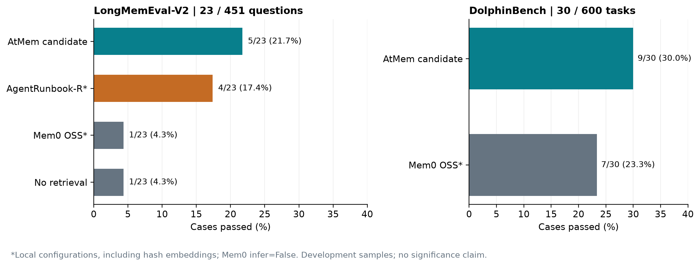

# AtMem 2.3.8 development benchmark

AtMem 2.3.8 led the recorded local comparator configurations on two frozen development samples. These are matched, constrained local runs. They are not official full-benchmark scores or a general state-of-the-art claim.

## Results

| Benchmark and metric | AtMem 2.3.8 | AgentRunbook-R | Mem0 OSS | No retrieval |
|---|---:|---:|---:|---:|
| LongMemEval-V2 correct answers | **5/23 (21.7%)** | 4/23 (17.4%) | 1/23 (4.3%) | 1/23 (4.3%) |
| DolphinBench tasks passed | **9/30 (30.0%)** | Not tested | 7/30 (23.3%) | Not tested |
| DolphinBench checks passed | **32/97 (33.0%)** | Not tested | 27/97 (27.8%) | Not tested |

The samples cover 23 of 451 LongMemEval-V2 questions and 30 of 600 DolphinBench tasks. Every attempted case remains in the denominator.



## Integrity evaluation

The release was also tested against the unchanged AGMI 0.6.3 attack runner.

| Integrity profile | Attacks detected | Historical AtMem 2.3.7 |
|---|---:|---:|
| Audit chain only | 8/9 | 0/9 |
| Audit chain plus trusted external checkpoint | **9/9** | 1/9 |

The chain-only profile cannot distinguish an old, internally valid store from a legitimate earlier state. Detecting whole-store snapshot rollback requires trusted state outside the attacker-controlled store directory. This is an AtMem-maintainer reproduction; independent AGMI reproduction is pending.

## Evaluation configuration

| Component | Recorded configuration |
|---|---|
| Reader/agent | `Qwen/Qwen3.5-9B` at revision `c202236235762e1c871ad0ccb60c8ee5ba337b9a` |
| Semantic judge | `gpt-5.2-2025-12-11` where judging applied |
| AtMem | 2.3.8 candidate; final Dolphin candidate commit `b97d35e` |
| AgentRunbook-R | LongMemEval-V2 checkout `2cc8c540`; no separate release number recorded |
| Mem0 OSS | Source revision `d3891e48`, declaring version 2.1.0 |
| LongMem embeddings | 768-dimensional local token-hash embeddings |
| Dolphin Mem0 embeddings | 256-dimensional local hash embeddings; optional spaCy and `fastembed` extras absent |

Mem0 ingested raw records with `infer=False`. The local configurations do not reproduce the competitors' strongest published settings or the hosted Mem0 service.

## Execution notes

- LongMemEval-V2 recorded 6 AtMem system failures, 4 AgentRunbook-R failures, and 1 Mem0 failure.
- Final DolphinBench AtMem and Mem0 arms recorded zero system failures.
- Dolphin fresh removal controls passed 30/30, restoration opened the gate in 30/30 cases, and paired removal-positive controls passed 29/30.
- Aggregate counts are too small for a conventional paired significance claim. The possible paired tests derived from the aggregates are included in `derived-statistics.json`.

## Files

- `results.csv`: machine-readable benchmark rows used by the Hugging Face dataset viewer.
- `benchmark-metadata.json`: scope, versions, revisions, claims, and evidence hashes.
- `derived-statistics.json`: possible paired-test outcomes consistent with the available aggregates.
- `atmem-2.3.8.pdf`: technical paper with architecture, methodology, and limitations.
- `REPRODUCING.md`: exact environment, source, data, preflight, and rerun instructions.
- `source/`: complete AtMem source snapshots for the final Dolphin and AGMI candidates.
- `protocols/`: frozen split, model, provider, scorer, cost, and attribution protocols.
- `baselines/` and `reports/`: recorded aggregate artifacts and the development report.
- `scripts/bootstrap_reproduction.sh`: obtains the pinned upstream repositories and LongMemEval-V2 data without silently starting a paid run.
- `scripts/verify_bundle.py`: validates this package, source snapshots, protocols, and optional upstream datasets by SHA-256.

## Reproducibility boundary

This repository includes every reproduction artifact retained in the AtMem source repository: complete candidate source snapshots, frozen protocols and IDs, aggregate results, hashes, runner instructions, and verification tools. The benchmark corpora and model weights remain in their official repositories and are fetched at the pinned revisions because their distribution terms remain upstream-controlled.

The original per-case paid-provider transcripts named by several recorded hashes are not available in this bundle. A hash proves whether a separately obtained artifact matches the recorded run, but cannot reconstruct that artifact. Independent reproduction therefore requires rerunning the pinned reader and judge routes. Paid execution is never started by the bootstrap script.

## Evidence

- [Frozen 5% development report](https://github.com/aetna000/atmem/blob/9c5f3766c6326d35403d1a62d796e380ecea196c/output/pdf/atmem-2.3.8-paper/evidence/benchmarks/retrieval_quality/reports/five-percent-results-20261010.md)
- [LongMemEval-V2 protocol](https://github.com/aetna000/atmem/blob/9c5f3766c6326d35403d1a62d796e380ecea196c/output/pdf/atmem-2.3.8-paper/evidence/benchmarks/retrieval_quality/protocols/longmemeval-v2-development-5pct-v1.json)
- [DolphinBench protocol](https://github.com/aetna000/atmem/blob/9c5f3766c6326d35403d1a62d796e380ecea196c/output/pdf/atmem-2.3.8-paper/evidence/benchmarks/retrieval_quality/protocols/dolphinbench-development-5pct-v1.json)
- [AtMem repository](https://github.com/aetna000/atmem)

## Citation

```bibtex
@techreport{atmem2026evidence,
  title        = {Evidence Coverage Meets Memory Governance: The AtMem 2.3.8 Architecture and Development Evaluation},
  author       = {{AtMem.Ai Lab}},
  year         = {2026},
  institution  = {AtMem.Ai Lab},
  type         = {Technical report}
}
```
